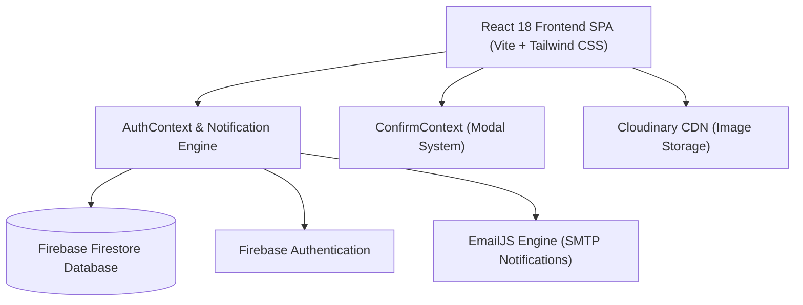

# 🗳️ E-Voting System Pakistan - Complete A-to-Z Technical Guide & System Manual

Welcome to the complete documentation for the **Election Commission of Pakistan (ECP) Digital E-Voting Portal**. This document provides an exhaustive, line-by-line, component-by-component analysis of how this full-stack web application was engineered, the technology stack utilized, data schemas, user workflows, security mechanisms, and deployment guidelines.

---

## 📐 1. System Architecture & Tech Stack

The application is built as a high-performance **Single Page Application (SPA)** adhering to modern web design standards (glassmorphism UI, real-time sync, dark mode, responsive layouts).



### 🧰 Technical Stack Breakdown

| Layer | Technology / Library | Version | Purpose & Usage |
| :--- | :--- | :--- | :--- |
| **Framework / Core** | `React` | `^18.3.1` | UI Component library and Virtual DOM rendering engine. |
| **Build Tool** | `Vite` | `^7.1.1` | Ultra-fast HMR dev server & production bundling. |
| **Routing** | `react-router-dom` | `^7.8.0` | Client-side routing with role-based `ProtectedRoute` guards. |
| **Database** | `Firebase Firestore` | `^10.8.0` | Cloud NoSQL database for real-time election state synchronization. |
| **Authentication** | `Firebase Auth` + `bcryptjs` | `^10.8.0` / `^2.4.3` | Dual authentication (Firebase Auth & local hash comparisons). |
| **Styling** | `Tailwind CSS` + `PostCSS` | `^3.4.1` | Utility-first CSS engine with custom glassmorphism extensions. |
| **Animations** | `Framer Motion` | `^12.40.0` | Smooth page transitions, modal popups, and drawer slides. |
| **Icons** | `Lucide React` | `^0.344.0` | Modern vector icon pack tailored for administrative interfaces. |
| **Notifications (UI)**| `React Toastify` | `^9.1.3` | Pop-up toast notifications for feedback and alerts. |
| **Email Service** | `@emailjs/browser` | `^4.4.1` | Direct browser-to-email notifications for approvals & updates. |
| **Media Uploads** | `Cloudinary API` | Unsigned REST | Direct browser-to-Cloudinary image uploads with XHR progress. |

---

## 📁 2. File & Directory Structure

```
project/
├── public/
│   └── logo.png                       # Official ECP Logo asset
├── src/
│   ├── components/
│   │   ├── ChangePasswordModal.jsx    # Modal component for security updates
│   │   ├── CloudinaryUploader.jsx     # Drag-and-drop image upload with XHR progress
│   │   ├── Footer.jsx                 # Public footer with quick navigation & links
│   │   ├── LoadingSpinner.jsx         # Custom emerald spinner animation
│   │   ├── Navbar.jsx                 # Dynamic role-based header with badge & actions
│   │   └── NotificationDrawer.jsx     # Live slide-over notification center
│   ├── context/
│   │   ├── AuthContext.jsx            # User state, notification polling, & email trigger
│   │   └── ConfirmContext.jsx         # Global promise-based confirmation dialogs
│   ├── data/
│   │   └── constituencies.json        # Pre-seeded National & Provincial constituencies
│   ├── pages/
│   │   ├── admin/
│   │   │   ├── AdminApprovals.jsx     # Party & Independent Candidate request management
│   │   │   ├── AdminConstituencies.jsx# Constituency CRUD & JSON importer
│   │   │   ├── AdminDashboard.jsx     # Administrative Command Center & metrics
│   │   │   ├── ConstituencyOverview.jsx# Comprehensive voter turnout & candidate mapping
│   │   │   ├── CreateEvent.jsx        # Launch new National/Provincial election events
│   │   │   └── EventDetails.jsx       # Event management, candidate list & results
│   │   ├── candidate/
│   │   │   └── CandidateDashboard.jsx # Console for Independent Candidates
│   │   ├── party/
│   │   │   └── PartyDashboard.jsx     # Control Room for Political Party Managers
│   │   ├── voter/
│   │   │   ├── LiveResults.jsx        # Real-time election leaderboards & charts
│   │   │   ├── VoterDashboard.jsx     # Registered voter portal & active polling cards
│   │   │   ├── VoterHistory.jsx       # Voter receipts with cryptographic hashes
│   │   │   └── VotingPage.jsx         # Digital ballot paper with single-vote enforcement
│   │   ├── LandingPage.jsx            # Public homepage highlighting ECP security
│   │   └── LoginPage.jsx              # Multi-role authentication & registration portal
│   ├── services/
│   │   ├── emailService.js            # EmailJS wrapper with fallback handling
│   │   └── firebase.js                # Firestore & Auth initializations
│   ├── App.jsx                        # Main router setup & provider wrapping
│   ├── index.css                      # Custom Tailwind theme tokens & glass CSS rules
│   └── main.jsx                       # DOM mount point
├── .env                               # Environment configurations
├── package.json                       # Dependencies & npm scripts
├── tailwind.config.js                 # Tailwind design configuration
└── vite.config.js                     # Vite build setup
```

---

## 🔐 3. User Roles & Access Control Matrix

The platform enforces strict Role-Based Access Control (RBAC) via the `ProtectedRoute` wrapper component in `App.jsx`.

| Role | Access Permissions | Landing URL | Key Features |
| :--- | :--- | :--- | :--- |
| **ECP Admin** (`admin`) | Full platform authority | `/admin` | Create elections, manage constituencies, approve/reject party/candidate applications, force stop events, monitor live turnouts. |
| **Party Manager** (`party`) | Political party scope | `/party` | Manage party profile, view approved status, register team candidates into NA/PA constituencies, monitor candidate performance. |
| **Independent Candidate** (`independent`) | Candidate scope | `/candidate` | Track registration approval, manage electoral symbol, review assigned constituency details. |
| **Registered Voter** (`voter`) | Citizen voting scope | `/voter` | View assigned NA & PA constituencies, cast digital vote during active elections, inspect ballot receipt, track live results. |

---

## 🗄️ 4. Database Collections Schema (Firestore)

### 1. `constituencies`
* **id**: Document ID (e.g. `NA-1`, `PP-15`)
* **code**: Code string (e.g., `"NA-1"`, `"PS-101"`)
* **name**: Human readable title (e.g., `"Chitral Upper-cum-Lower"`)
* **type**: `"NA"` (National Assembly) or `"PA"` (Provincial Assembly)
* **province**: `"KPK"`, `"Punjab"`, `"Sindh"`, `"Balochistan"`, `"Islamabad"`
* **registeredVoters**: Number of total voters registered in this halka.

### 2. `events`
* **title**: Election event title (e.g., `"General Elections 2026"`)
* **type**: `"general"` or `"by-election"`
* **assemblyType**: `"NA"`, `"PA"`, or `"both"`
* **status**: `"active"`, `"inactive"`, or `"closed"`
* **startDate**: Event start ISO timestamp.
* **endDate**: Event end ISO timestamp.
* **targetConstituencyId**: Optional constituency target for by-elections.

### 3. `parties`
* **name**: Full party name (e.g., `"Pakistan Tehreek-e-Insaf"`)
* **acronym**: Abbreviation (e.g., `"PTI"`)
* **leader**: Party leader name.
* **email**: Party login credentials email.
* **status**: `"pending"`, `"approved"`, or `"rejected"`
* **symbolName**: Name of party symbol (e.g., `"Bat"`)
* **symbolUrl**: CDN link to party symbol image.
* **rejectionReason**: Reason provided if status is rejected.

### 4. `candidates`
* **name**: Candidate full name.
* **email**: Login email address.
* **partyId**: Ref to `parties` collection ID (or `"independent"`).
* **partyName**: Party title or `"Independent"`.
* **constituencyId**: ID of constituency candidate is running in.
* **symbolName**: Name of electoral symbol.
* **symbolUrl**: Image URL of electoral symbol.
* **status**: `"pending"`, `"approved"`, or `"rejected"`

### 5. `voters`
* **name**: Voter full name.
* **email**: Voter email.
* **cnic**: Formatted Pakistani CNIC (`XXXXX-XXXXXXX-X`).
* **naConstituency**: Assigned National Assembly ID (e.g., `NA-48`).
* **paConstituency**: Assigned Provincial Assembly ID (e.g., `PP-14`).
* **votedEvents**: Array of event IDs the voter has already voted in.

### 6. `votes`
* **eventId**: Foreign key referencing `events`.
* **constituencyId**: Foreign key referencing `constituencies`.
* **candidateId**: Candidate receiving the vote.
* **partyId**: Party receiving the vote.
* **timestamp**: ISO date string when vote was recorded.
* **auditHash**: SHA-256 cryptographic proof string generated upon vote submission.

---

## ⚡ 5. Deep-Dive Component & Module Analysis

### 1. `AuthContext.jsx` (Core Authentication & State Engine)
* **LocalStorage Synchronization**: Hydrates user context upon page reload.
* **Real-time Notification Polling**: Uses a `setInterval` running every 5 seconds to query local storage for incoming simulated notifications, opening the notification drawer automatically when unread alerts arrive.
* **Email Transmission Handling**: Integrates directly with `sendEmail()` service while simultaneously persisting notification history to local state.

### 2. `ConfirmContext.jsx` (Global Action Modal System)
* Replaces browser default `window.confirm()` popups with an animated glassmorphism dialog built using `framer-motion`.
* Returns a JavaScript `Promise<boolean>` enabling smooth async/await syntax:
  ```js
  const proceed = await confirm("Are you sure you want to exit your ECP Portal session?", {
    title: "Exit Session",
    type: "danger"
  });
  if (proceed) { /* execute action */ }
  ```

### 3. `CloudinaryUploader.jsx` (Drag-and-Drop Image CDN Engine)
* Handles browser-side image validation (Max 5MB, format check).
* Executes an unsigned HTTP POST request via `XMLHttpRequest` directly to Cloudinary:
  `POST https://api.cloudinary.com/v1_1/{CLOUD_NAME}/image/upload`
* Displays a live progress bar percentage during upload and fires `onUpload(url)` upon resolution.

### 4. `VotingPage.jsx` (Digital Ballot Box)
* Loads candidates approved specifically for the voter's assigned constituency.
* Enforces **Single Vote Safeguard**: Checks if voter CNIC/ID already exists in `votedEvents` array before enabling candidate selection buttons.
* Generates a unique 64-character audit hash upon casting vote:
  ```js
  const auditHash = `ECP-${eventId.slice(-4)}-${Date.now()}-${Math.random().toString(36).substr(2, 9).toUpperCase()}`;
  ```
* Updates `votes` collection and appends `eventId` to voter's profile in atomic sequence.

### 5. `AdminApprovals.jsx` (Application Verification Portal)
* Admin command view to inspect pending Party and Candidate applications.
* Features a tabbed UI separating Political Parties and Independent Candidates.
* Upon clicking **Approve**: Status updates to `approved` in Firestore and an email notification is automatically dispatched.
* Upon clicking **Reject**: Prompts for a mandatory rejection explanation, records the reason in the database, and alerts the applicant via EmailJS.

---

## 🚀 6. Step-by-Step Installation & Setup Guide

### Prerequisites
- **Node.js**: v18.0.0 or higher
- **npm**: v9.0.0 or higher

### 1. Clone & Install Dependencies
```bash
git clone <repository-url>
cd project
npm install
```

### 2. Configure Environment Variables (`.env`)
Create a `.env` file in the root directory:
```env
# Firebase Setup
VITE_FIREBASE_API_KEY=AIzaSy...
VITE_FIREBASE_AUTH_DOMAIN=e-voting-system-ae1b4.firebaseapp.com
VITE_FIREBASE_PROJECT_ID=e-voting-system-ae1b4

# Cloudinary Setup
VITE_CLOUDINARY_CLOUD_NAME=your_cloud_name
VITE_CLOUDINARY_UPLOAD_PRESET=ecp_portal

# EmailJS Setup
VITE_EMAILJS_SERVICE_ID=service_xxx
VITE_EMAILJS_TEMPLATE_ID=template_xxx
VITE_EMAILJS_PUBLIC_KEY=user_xxx
```

### 3. Launch Development Server
```bash
npm run dev
```
Open your browser at `http://localhost:5173`.

### 4. Production Build
```bash
npm run build
npm run preview
```

---

## 🎨 7. UI/UX Design System Highlights

* **Emerald Palette**: Built around `#022c22` (`emerald-950`) representing the national colors of Pakistan.
* **Gold Highlights**: Accented with `#eab308` (`yellow-500`) for administrative titles and ECP badges.
* **Glassmorphism**: Enhanced with backdrop blur and semi-transparent borders:
  ```css
  background: rgba(2, 8, 5, 0.85);
  backdrop-filter: blur(24px) saturate(180%);
  border-bottom: 1px solid rgba(16, 185, 129, 0.12);
  ```
* **Interactive Micro-animations**: Leverages Framer Motion hover states, pulse glows, and floating notification banners.

---

## 🛡️ 8. Security & Integrity Safeguards

1. **Constituency Locking**: Voters are restricted to voting *only* in candidates assigned to their registered NA and PA constituencies.
2. **Duplicate Vote Prevention**: Double voting is prevented both on client UI (disabling ballot card) and server database logic (checking history records).
3. **Symbol Conflict Safeguard**: Real-time checking during registration ensures no two parties or independent candidates can claim the same electoral symbol.
4. **Bypass Login System**: For evaluation and demo purposes, demo credentials with single-click bypass logins are provided on the login page.

---

## 📌 Summary

This E-Voting system delivers a complete, secure, transparent, and user-friendly solution for digital election management in Pakistan. It covers the full lifecycle from party registration and constituency allocation to real-time vote casting and live results calculation.
